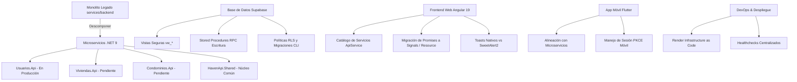

# Propuesta y Hoja de Ruta de Reestructuración Global del Sistema

> **Visión:** Guía arquitectónica integral para la transición ordenada del monolito legado hacia una arquitectura distribuida (microservicios + Supabase + Angular + Flutter), garantizando estabilidad, seguridad (KISS) y mantenibilidad.

---

## 🗺️ Mapa de Áreas de Reestructuración



---

## 1. ⚙️ Backend y Microservicios (.NET 9)

### 1.1. Desacople y Extinción Definitiva del Monolito
* **Estado actual:** Existe la carpeta `services/backend/` en coexistencia temporal con `services/Usuarios.Api/`.
* **Problema:** Mantiene duplicidad de código, configuraciones obsoletas y confusión en los miembros del equipo sobre qué endpoint consumir.
* **Acción de reestructuración:**
  1. Extraer los controladores restantes (`ViviendasController`, `CondominiosController`) a sus respectivos proyectos aislados:
     * `services/Viviendas.Api/`
     * `services/Condominios.Api/`
  2. Borrar completamente `services/backend/` del repositorio.
  3. Descomentar y activar los servicios correspondientes en `render.yaml`.

### 1.2. Estandarización de `HavenApi.Shared`
* **Estado actual:** Contiene extensiones de autenticación y utilidades compartidas.
* **Problema:** Cada microservicio nuevo corre el riesgo de reinventar el manejo de errores, CORS y validación de tokens.
* **Acción de reestructuración:**
  * **Manejo global de excepciones:** Implementar un middleware estándar que devuelva respuestas bajo el estándar **RFC 7807 (ProblemDetails)**.
  * **Healthchecks uniformes:** Configurar `app.MapHealthChecks("/health")` que verifique la conectividad con Supabase de forma nativa.
  * **CORS centralizado:** Registrar una política unificada que permita tanto `localhost:4200` (desarrollo) como el dominio de producción en Vercel (`residential-management-program.vercel.app`).

---

## 2. 🗄️ Base de Datos y Seguridad (Supabase / PostgreSQL)

### 2.1. Contrato Estricto de Acceso a Datos
* **Estado actual:** Se detectaron errores PostgreSQL `42501 (insufficient privilege)` por bloqueos directos a tablas base (`usuarios`, `viviendas`).
* **Acción de reestructuración:**
  * **Lecturas (Queries):** Obligatoriamente a través de vistas públicas seguras con permisos explícitos:
    * `vw_usuarios` (con `GRANT SELECT TO authenticated, anon;`).
    * `vw_viviendas` (con `GRANT SELECT TO authenticated, anon;`).
    * `vw_condominios` (con `GRANT SELECT TO authenticated, anon;`).
  * **Escrituras (Mutaciones):** Obligatoriamente mediante Stored Procedures con `SECURITY DEFINER` y validación de actor:
    * `rpc/sp_crear_usuario`
    * `rpc/sp_crear_vivienda`
    * `rpc/sp_asignar_residente_vivienda`
  * **Cero bypass:** Ningún microservicio ni cliente debe intentar hacer `INSERT/UPDATE/DELETE` directo a las tablas base.

### 2.2. Gestión de Migraciones Versionadas
* **Estado actual:** Se aplican cambios manuales desde el Dashboard Web de Supabase que no quedan reflejados de inmediato en Git.
* **Acción de reestructuración:**
  * Adoptar el flujo formal de migraciones con **Supabase CLI**:
    ```bash
    supabase db diff -f nombre_de_migracion
    ```
  * Cada cambio de esquema, vista o stored procedure debe residir en `supabase/migrations/` como código auditable antes de pasar a producción.

---

## 3. 🌐 Frontend Web (Angular 19 Standalone)

### 3.1. Evolución del `ApiService` a Gateway Dinámico
* **Estado actual:** `ApiService` resuelve rutas relativas (`/api/auth`, `/api/viviendas`, etc.) basándose en prefijos fijos.
* **Acción de reestructuración:**
  * A medida que los microservicios migren de la URL del monolito a sus propias URLs independientes de Render, actualizar el mapa en `environment.ts`:
    ```typescript
    services: {
      default: 'https://residential-management-program-1.onrender.com',
      usuarios: 'https://usuarios-api-n1qi.onrender.com',
      viviendas: 'https://viviendas-api-xxxx.onrender.com',
      condominios: 'https://condominios-api-xxxx.onrender.com'
    }
    ```
  * Crear un cliente fuertemente tipado por módulo (`UsuariosClient`, `ViviendasClient`) para evitar strings "en crudo" en las llamadas HTTP.

### 3.2. Modernización Reactiva (Signals & Resource API)
* **Estado actual:** Se utiliza `firstValueFrom` para transformar llamadas `Observable` en `Promise`, mezclando paradigmas síncronos con signals locales manuales.
* **Acción de reestructuración:**
  * Adoptar la nueva API de Angular 19 `rxResource` o `httpResource` para vincular peticiones directamente a señales reactivas, eliminando boilerplate de `isLoading`, `errorMessage` y flags manuales en los componentes.

### 3.3. Limpieza de Dependencias Externas (SweetAlert2)
* **Estado actual:** Warning recurrente de CommonJS en build por uso de `sweetalert2`.
* **Acción de reestructuración:**
  * Crear un componente ligero de Toasts (`AppToastService`) usando Tailwind CSS y Signals nativos de Angular.
  * Beneficio: Eliminación del warning en CI/CD y reducción del peso del bundle de producción en ~80 kB.

---

## 4. 📱 Aplicación Móvil (Flutter)

### 4.1. Sincronización de Contratos con el Backend
* **Estado actual:** La app móvil apunta a configuraciones que pueden desfasarse frente a la migración de microservicios de Web.
* **Acción de reestructuración:**
  * Crear una capa de configuración centralizada en `mobile/lib/core/config/` similar al `environment.ts` de Angular, donde se definan las URLs de los microservicios activos.
  * Implementar interceptores HTTP en `dio` o `http` que adjunten el Bearer token de Supabase dinámicamente a cualquiera de las APIs registradas.

### 4.2. Flujo de Autenticación Unificado
* **Acción de reestructuración:**
  * Configurar `supabase_flutter` con detección de sesión profunda (deep linking) para soportar el login de Google OAuth bajo el mismo esquema de roles que en Web (Google exclusivo para residentes; correo/contraseña para staff/vigilancia).

---

## 5. 🚀 DevOps, CI/CD y Despliegues

| Componente | Plataforma | Meta de Reestructuración |
|---|---|---|
| **Web** | Vercel | Configurar Preview Deployments automáticos por Pull Request para pruebas antes de fusionar a `main`. |
| **Usuarios.Api** | Render | Pipeline Docker independiente validado con `Dockerfile` multi-etapa ligero. |
| **Viviendas.Api** | Render | Despliegue automatizado vía `render.yaml` una vez completada la migración. |
| **Condominios.Api** | Render | Despliegue automatizado vía `render.yaml`. |
| **Supabase** | Cloud | Sincronización continua de migraciones vía GitHub Actions (`supabase db push`). |

---

## 📅 Hoja de Ruta Priorizada (Fases)

### Fase 1: Estabilización Inmediata (Sprint Actual)
- [x] Conexión de `Usuarios.Api` con el frontend Web.
- [x] Login combinado (Residente + Staff) con Google OAuth y PKCE.
- [ ] Aplicar commits por separado y fusionar ramas mediante PRs limpios.

### Fase 2: Extracción de Viviendas y Condominios
- [ ] Creación de `services/Viviendas.Api` y `services/Condominios.Api`.
- [ ] Despliegue en Render y activación en `render.yaml`.
- [ ] Actualización de URLs en `environment.services` de Angular.
- [ ] Recuperar el módulo de viviendas del stash (`git stash pop`) y conectarlo al nuevo microservicio.

### Fase 3: Purga y Optimización
- [ ] Eliminación completa de `services/backend/` (Monolito).
- [ ] Reemplazo de SweetAlert2 por toasts nativos en Angular.
- [ ] Sincronización de la app móvil Flutter con los nuevos microservicios.
- [ ] Automatización de migraciones en CI/CD.
